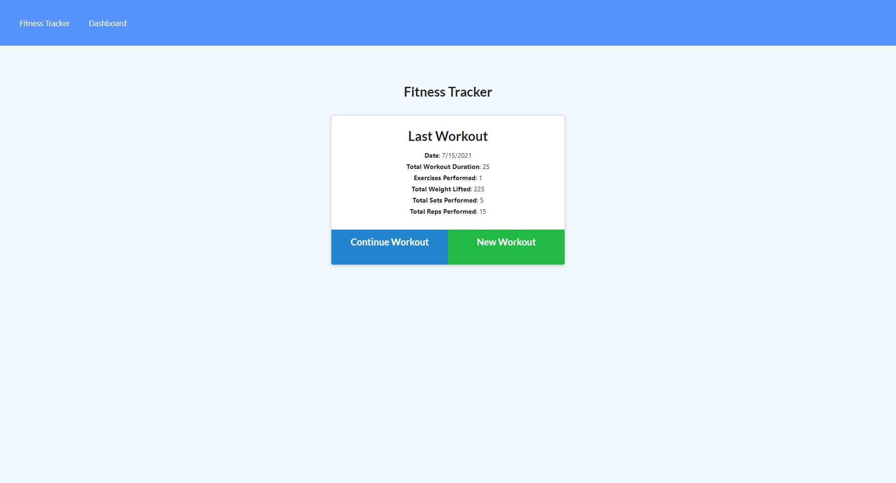
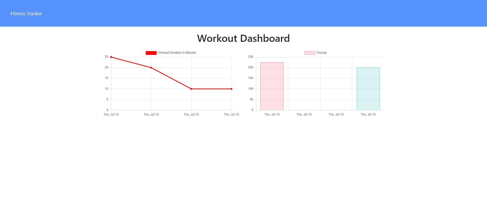

# fitnesstracker

Eighteenth week's homework for UNH Full-Stack Web Development Boot Camp

## Description

The goal of this project was to create a Mongo database and handle routes with Express - in conjunction with provided front-end code - to create a fitness tracker. Our main tasks were to ensure that:

* When the user loads the page, they are given the option to create a new workout or update their last workout. 

* The user should be able to add exercises to the most recent workout plan.

* The user should be able to add new exercises to a new workout plan.

* The user should be able to view the combined weight of multiple exercises from the past seven workouts on a 'stats' page.

* The user should be able to view the total duration of each workout from the past seven workouts on a 'stats' page.

## Built With

* Express
* Javascript
* Node.js
* Mongoose
* MongoDB

## Links

* [GitHub Repository](https://github.com/shabobble/fitnesstracker)
* [Deployed app](https://still-forest-94479.herokuapp.com/)

## Screenshot

## Installation

No installation required

## Credits

* Instructor - Gabe Perry [GitHub](https://github.com/Gperry22)
* TA - Andrew Hatfield
* Tutor - Joseph Young
* Study Group - Alan Balcom [GitHub](https://github.com/abalcs)

## __License__ 

 This project is licensed under the [MIT License](https://choosealicense.com/licenses/mit). 

